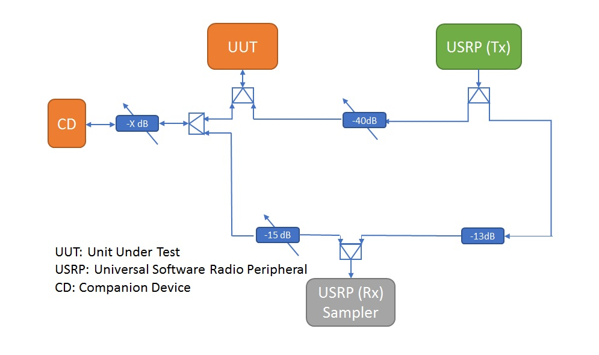

# Preamble Detection Test

In the IEEE 802.11 standard, each device should detect and extract the information in the preamble  to be able to determine whether the signal is noise or not. In addition, to avoid the packets collision during the transmission. The frame length in the preamble should be determined, where the device can know the period to be silent within. In this test, we check the compliance of commercial WiFi networking devices to the IEEE 802.11 standard. 


**Note**: This project is under active development, and a stable release branch has not yet been established.
The ```master``` branch is where the most stable version can be found, but interface and functionality contained therein are not yet guaranteed to be consistent or fully operational.

## Hardware Requirements

The following is a list of essential components for the preamble detection test:

* One or more wireless networking devices, known as the Unit(s) Under Test (UUTs) with USB and/or Gigabit Ethernet LAN connectivity
* One or two modern computers with USB 3.0 and Gigabit Ethernet ports (see Installation and Test Setup for the single-machine method)
* A software-defined radio capable of transmitting and receiving on the same wireless bands as the UUTs
* An anechoic chamber, or alternatively a series of shielded cabling to connect the devices in use

Preamble test was originally developed and tested using the [Ettus Research B200](https://www.ettus.com/product/details/UB200-KIT) software-defined radio device, which is the core measurement tool that senses the wireless channel and collects the data for further processing. No other devices are currently supported (although additional devices are on the roadmap). The (UUT) in a typical test setup is a either a commercially-available USB WiFi device, or a wireless router.

Below is a diagram showing an example test setup previously used at the Carleton Broadband Networks Laboratory:



## Software Requirements

Preamble test was written and tested on systems running Fedora 28 and Ubuntu 16.04, but it should work on any modern Linux operating system with the following installed:

* Python 3 (written and tested on 3.6.5 and later 3.7.x)
* PyQt5
* gnuradio (for the core writeIQ script)

Additionally, one script (```utils/writeIQ.py```) is currently written in Python 2, but will be updated as part of the project goals.

Early versions of the tool relied upon the use of the [MATLAB Engine for Python](https://www.mathworks.com/help/matlab/matlab-engine-for-python.html); however a significant effort was undertaken by the members of the Carleton University Broadband Networks Laboratory to rewrite the prototypical scripts in Python 3. Copies of the original MATLAB code are contained in the ```matlab``` folder for reference.

## Authors

* **Ammar Alhosainy**
* **Shady Elkamhawy**
* **Yousef Alnagar**
