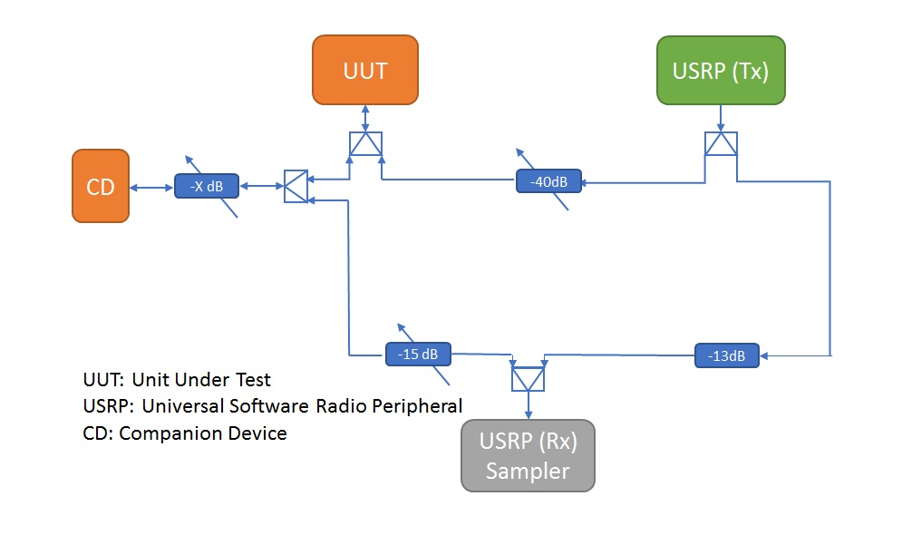

# Preamble Detection Test

In the IEEE 802.11 standard, each device should detect and extract the information in the preamble  to be able to determine whether the signal is noise or not. In addition, to avoid the packets collision during the transmission. The frame length in the preamble should be determined, where the device can know the period to be silent within. In this test, we check the compliance of commercial WiFi networking devices to the IEEE 802.11 standard. 


**Note**: This project is under active development, and a stable release branch has not yet been established.
The ```master``` branch is where the most stable version can be found, but interface and functionality contained therein are not yet guaranteed to be consistent or fully operational.

## Hardware Requirements

The following is a list of essential components for using ANTS in its current form:

* One or more wireless networking devices, known as the Unit(s) Under Test (UUTs) with USB and/or Gigabit Ethernet LAN connectivity
* One or two modern computers with USB 3.0 and Gigabit Ethernet ports (see Installation and Test Setup for the single-machine method)
* A software-defined radio capable of transmitting and receiving on the same wireless bands as the UUTs
* An anechoic chamber, or alternatively a series of shielded cabling to connect the devices in use

Preamble test was originally developed and tested using the [Ettus Research B200](https://www.ettus.com/product/details/UB200-KIT) software-defined radio device, which is the core measurement tool that senses the wireless channel and collects the data for further processing. No other devices are currently supported (although additional devices are on the roadmap). The (UUT) in a typical test setup is a either a commercially-available USB WiFi device, or a wireless router.

Below is a diagram showing an example test setup previously used at the Carleton Broadband Networks Laboratory:



## Software Requirements

Preamble test was written and tested on systems running Fedora 28 and Ubuntu 16.04, but it should work on any modern Linux operating system with the following installed:

* Python 3 (written and tested on 3.6.5 and later 3.7.x)
* PyQt5
* gnuradio (for the core writeIQ script)

Additionally, one script (```utils/writeIQ.py```) is currently written in Python 2, but will be updated as part of the project goals.

Early versions of the tool relied upon the use of the [MATLAB Engine for Python](https://www.mathworks.com/help/matlab/matlab-engine-for-python.html); however a significant effort was undertaken by the members of the Carleton University Broadband Networks Laboratory to rewrite the prototypical scripts in Python 3. Copies of the original MATLAB code are contained in the ```matlab``` folder for reference.

## Installation and Test Setup

Due to the size of the raw data files created, it is recommended that a significant amount of storage space (120GB or more) is allocated for the ANTS suite to operate. For a fresh installation of Ubuntu 16.04, the following must be performed in order to make ANTS operational:

1. ```sudo apt install git python3-numpy python3-matplotlib python3-pip gnuradio iperf python3-dev```
2. ```pip3 install pyqt5 netifaces``` (this may need to be run with sudo)
3. Run ```uhd_images_downloader``` to prepare the FPGA binary for use with the USRP
4. From the home directory (or wherever you want to store your copy of the project), ```git clone https://github.com/CarletonWirelessLab/ANTS```
5. Run ANTS by typing ```sudo python3 ants/ants``` from the main ANTS directory;
6. Set test parameters - particularly the access point IP address - and press "Run";
7. Collect the results.

Depending on the Ubuntu version (i.e. 18.04 or later) you may need to additionally install ```ifconfig``` and related legacy test tools.

When using a laptop as the test machine, the internal wireless card should be disabled **unless** it is the device under test, otherwise the test sequence may not perform as expected. The ANTS tool will try to automatically perform this operation for you (provided you have checked the automatic routing box), but if it fails it will need to be done manually.

An attenuator of 30dB (50 Ohms) is recommended between the access point and the splitter.

The majority of the current testing has been performed using an ASUS USB-AC56 USB WiFi device. Note that the driver for this device for Ubuntu 16.04 is located [here](https://github.com/abperiasamy/rtl8812AU_8821AU_linux).

The following is a diagram showing how to connect the test hardware for testing without an anechoic chamber:


## Authors

* **Ammar Alhosainy**
* **Shady Elkamhawy**
* **Yousef Alnagar**
